# 🚀 Hệ Thống Tự Động Hóa CI/CD Chuẩn Enterprise

<div align="center">

  <!-- Huy hiệu trạng thái thời gian thực -->
  <a href="https://github.com/Ma1910/test-cicd/actions">
    
  </a>
  <a href="https://github.com/Ma1910/test-cicd">
    
  </a>
  <a href="https://github.com/Ma1910/test-cicd">
    
  </a>
  <a href="https://github.com/Ma1910/test-cicd">
    
  </a>

  <br/><br/>

  <!-- Logo các công nghệ chính -->
  
  
  
  
  

  <p align="center">
    <em>Dự án mẫu thực tế giúp bạn hiểu và áp dụng quy trình CI/CD chuyên nghiệp một cách đơn giản, trực quan nhất.</em>
  </p>

</div>

---

## 💡 CI/CD là gì? (Giải thích dễ hiểu nhất)

Hãy tưởng tượng bạn đang làm ra một chiếc xe hơi:

| Làm thủ công (Trước khi có CI/CD) | Có CI/CD (Hệ thống này) |
| :--- | :--- |
| ❌ Bạn viết code xong phải tự chạy thử từng tính năng. | ✅ **Tự động 100%**: Vừa đẩy code lên là hệ thống tự kiểm tra từ A-Z. |
| ❌ Dễ quên mật khẩu, API key bí mật trong code dẫn đến bị hacker tấn công. | ✅ **Người gác cổng an ninh**: Tự động phát hiện và chặn đứng nếu vô tình làm lộ token. |
| ❌ Code chạy được trên máy bạn nhưng đưa lên máy chủ thì bị lỗi do khác môi trường. | ✅ **Kiểm thử đa môi trường**: Tự động chạy thử trên cả Node 20 và Node 22 để đảm bảo không bao giờ lỗi. |
| ❌ Phải tự cài đặt, gõ lệnh đóng gói container phức tạp. | ✅ **Đóng gói thần tốc**: Tự động build Docker Image và đưa lên kho lưu trữ sẵn sàng dùng. |

> **Tóm lại:** Bạn chỉ cần tập trung **viết code** và gõ `git push`. Toàn bộ việc kiểm tra lỗi, bảo mật và đóng gói đã có hệ thống CI/CD này lo!

---

## 🗺️ Sơ đồ Luồng Hoạt Động Trực Quan (DAG Pipeline Flowchart)

Dưới đây là hành trình tự động của một đoạn code từ khi bạn viết xong cho đến khi xuất xưởng ra sản phẩm:

```mermaid
flowchart LR
    %% Thiết lập giao diện màu sắc hiện đại
    classDef startNode fill:#6366f1,stroke:#4f46e5,stroke-width:2px,color:#fff;
    classDef checkNode fill:#0ea5e9,stroke:#0284c7,stroke-width:2px,color:#fff;
    classDef testNode fill:#10b981,stroke:#059669,stroke-width:2px,color:#fff;
    classDef packNode fill:#f59e0b,stroke:#d97706,stroke-width:2px,color:#fff;
    classDef deployNode fill:#8b5cf6,stroke:#7c3aed,stroke-width:2px,color:#fff;

    subgraph Phase1 ["1. Tiếp nhận & Thẩm định sớm"]
        Push(["💻 Developer Push Code"]):::startNode
        Sec["🛡️ Quét rò rỉ mật khẩu<br/>(Trivy Secret Scanner)"]:::checkNode
        Type["🔍 Kiểm tra chuẩn kiểu dữ liệu<br/>(TypeScript Strict)"]:::checkNode
    end

    subgraph Phase2 ["2. Phòng Kiểm thử Đa Môi trường"]
        Node20["🧪 Chạy test trên Node.js 20 LTS<br/>(Vitest Engine)"]:::testNode
        Node22["⚡ Chạy test trên Node.js 22 LTS<br/>(Vitest Engine)"]:::testNode
    end

    subgraph Phase3 ["3. Chốt chặn Chất lượng"]
        Gate["📊 Thẩm định độ phủ Code<br/>(Bắt buộc Coverage ≥ 80%)"]:::testNode
        SAST["🔬 Quét mã độc thư viện<br/>(Trivy SAST & Audit)"]:::checkNode
    end

    subgraph Phase4 ["4. Đóng gói Container"]
        Docker["🐳 Đóng gói Docker Multi-stage<br/>(Phân quyền Non-Root bảo mật)"]:::packNode
    end

    subgraph Phase5 ["5. Bàn giao & Triển khai"]
        Staging["🧪 Chạy thử nghiệm Staging<br/>(Bắn Smoke Test kiểm tra 200 OK)"]:::deployNode
        Prod["🚀 Phát hành Production<br/>(Bảo vệ Rollback nếu có lỗi)"]:::deployNode
        Report["📋 Báo cáo tổng kết tự động<br/>(Executive Quality Report)"]:::deployNode
    end

    %% Các đường kết nối luồng công việc
    Push --> Sec
    Push --> Type

    Sec --> Node20
    Type --> Node22
    Sec --> SAST
    Type --> SAST

    Node20 --> Gate
    Node22 --> Gate

    Gate --> Docker
    SAST --> Docker

    Docker --> Staging
    Staging --> Prod
    Prod --> Report
```



---

## 🛡️ 7 Lớp phòng vệ chất lượng của hệ thống

1. **Quét rò rỉ mật khẩu (Secret Leak Scanner)**:
   - Phát hiện ngay lập tức nếu bạn vô tình commit các token bí mật (như GitHub Token, AWS Key, Database Password). Nếu phát hiện, pipeline sẽ **dừng khẩn cấp** để bảo vệ tài khoản của bạn.
2. **Kiểm tra kiểu dữ liệu nghiêm ngặt (TypeScript Check)**:
   - Đảm bảo toàn bộ mã nguồn không có bất kỳ lỗi logic cú pháp nào trước khi đóng gói.
3. **Kiểm thử song song trên nhiều phiên bản (Parallel Matrix Testing)**:
   - Ứng dụng được chạy thử nghiệm tự động trên cả **Node 20 (bản ổn định doanh nghiệp)** và **Node 22 (bản mới nhất)** cùng lúc.
4. **Chốt chặn độ phủ kiểm thử (80% Coverage Gate)**:
   - Đảm bảo mọi tính năng viết ra đều được viết kiểm thử bảo vệ. Hiện tại dự án đạt **100% Code Coverage**.
5. **Đóng gói Docker chuẩn bảo mật cao (Container Hardening)**:
   - Sử dụng kiến trúc Multi-stage giúp dung lượng container siêu nhẹ và chạy dưới quyền tài khoản thường (`non-root user`) để chống hacker leo thang đặc quyền.
6. **Thử nghiệm tự động (Automated Smoke Test)**:
   - Sau khi dựng xong ứng dụng trên môi trường Staging, hệ thống tự động bắn tín hiệu HTTP kiểm tra endpoint `/healthz`. Nếu máy chủ phản hồi `200 OK` và độ trễ dưới 20ms mới cho phép đi tiếp.
7. **Cơ chế khôi phục tự động (Automated Rollback)**:
   - Trong trường hợp bản cập nhật mới lên Production gặp sự cố bất ngờ, cơ chế rollback tự động khôi phục lại phiên bản chạy ổn định trước đó ngay tức khắc.

---

## 💻 Hướng dẫn chạy thử trên máy của bạn (Chỉ 3 bước)

Dự án này là **mã nguồn thật 100%**, bạn có thể tự mình chạy và kiểm chứng ngay tại máy tính của mình:

### Bước 1: Khởi động máy chủ
Mở terminal tại thư mục dự án và chạy:
```bash
npm run dev
```

### Bước 2: Kiểm tra trên trình duyệt
Sau khi chạy, bạn hãy mở trình duyệt lên:
- 🌐 **Trang chủ**: Mở `http://localhost:3000/` (Xem thông điệp phản hồi từ API).
- 🩺 **Kiểm tra sức khỏe hệ thống**: Mở `http://localhost:3000/healthz` (Xem thời gian uptime thực tế của server).

### Bước 3: Xem báo cáo độ phủ Code thật
Chạy lệnh kiểm thử tự động:
```bash
npm run test:coverage
```
*Vitest sẽ quét toàn bộ mã nguồn và hiển thị bảng đo lường chất lượng 100% trực tiếp trên terminal của bạn.*

---

## 🎯 Cách thử nghiệm CI/CD bắt lỗi (Tự tay làm thử)

Bạn muốn xem hệ thống CI/CD trên GitHub phát hiện và chặn code lỗi như thế nào?
1. Mở file `tests/app.test.ts` trong mã nguồn.
2. Tìm dòng `const simulateFail = false;` và đổi thành `const simulateFail = true;`.
3. Gõ lệnh đẩy code lên GitHub:
   ```bash
   git commit -am "test: co tinh tao loi de xem CI chan"
   git push origin main
   ```
4. Vào tab **Actions** trên GitHub: Bạn sẽ thấy hệ thống **lập tức báo đỏ ❌** tại bước kiểm thử và kiên quyết từ chối xuất xưởng bản build lỗi này!
