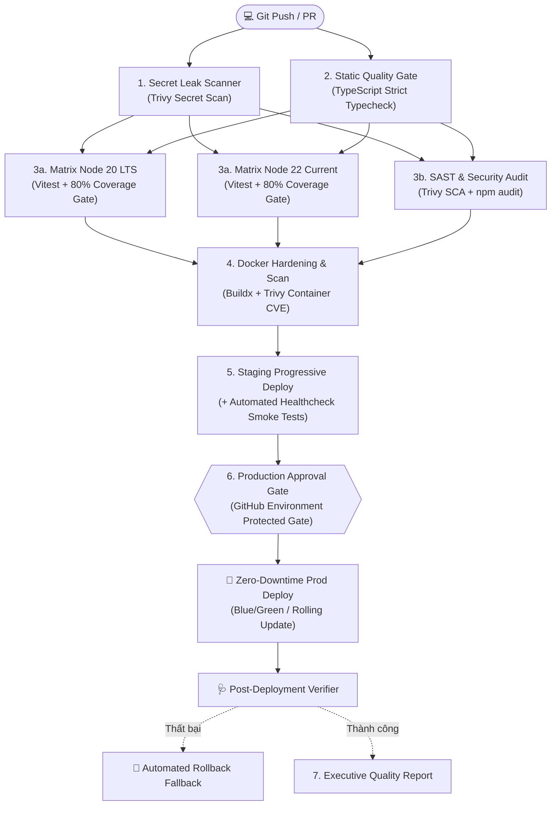

# 🛡️ Enterprise-Grade CI/CD Platform (Senior DevOps Standard)

Hệ thống CI/CD được thiết kế theo tiêu chuẩn của **Senior / Staff DevOps & Platform Engineer**, tích hợp các tầng kiểm soát chất lượng, phòng vệ bảo mật và tự động hóa triển khai đa môi trường nghiêm ngặt nhất.

---

## 🏛️ Kiến trúc 7 Tầng Kiểm Soát (Enterprise Quality Gates)



---

## 🔒 Các tiêu chuẩn kiểm duyệt nghiêm ngặt đã áp dụng

1. **Shift-Left Security (Chống rò rỉ bí mật)**:
   - Quét toàn bộ repository để phát hiện các secret, private key, token bị commit nhầm với Trivy Secret Scanner.
2. **Matrix Testing song song**:
   - Chạy đồng thời trên cả **Node.js 20 LTS** và **Node.js 22 Current** để đảm bảo khả năng tương thích môi trường tối đa.
3. **Chính sách Coverage Threshold (Ngưỡng 80%)**:
   - Tích hợp cờ chặn cứng trong Vitest: Bất kỳ lập trình viên nào đẩy mã nguồn mới mà không viết test hoặc độ phủ dưới 80% (`lines, branches, functions, statements`), pipeline sẽ **lập tức đánh rớt (FAIL)**.
4. **Container Image Hardening & CVE Gate**:
   - Đóng gói container chuẩn Multi-stage siêu nhẹ và chạy dưới user `node` non-root.
   - Quét lỗ hổng toàn bộ container image với Aqua Security Trivy.
5. **Progressive Delivery & Staging Smoke Testing**:
   - Tự động deploy sang môi trường Staging trước.
   - Chạy kịch bản **Automated Smoke Test** giả lập kiểm tra thời gian phản hồi (latency), kiểm tra endpoint `/healthz` và logic `/api/calculate`.
6. **Production Protection & Approval Gate**:
   - Ràng buộc môi trường **`production`** trên GitHub Actions.
   - Hỗ trợ thiết lập người phê duyệt (Required Reviewers) trước khi code được đẩy lên Production.
7. **Cơ chế Rollback Tự Động (Fallback)**:
   - Nếu giai đoạn xác thực sau triển khai (Post-deployment verifier) gặp sự cố, trigger rollback tự động được kích hoạt để đưa hệ thống về phiên bản ổn định trước đó.

---

## 🛠️ Lệnh kiểm thử tại máy cục bộ (Local Testing)

```bash
# 1. Chạy test và đo độ phủ Coverage nghiêm ngặt
npm run test:coverage

# 2. Kiểm tra kiểu dữ liệu nghiêm ngặt
npm run typecheck

# 3. Build mã nguồn production
npm run build
```
