# 🚀 Enterprise-Grade CI/CD Automation Platform

<div align="center">

  <!-- Interactive Live Simulator Launch Button for Visitors -->
  <a href="https://ma1910.github.io/test-cicd/" target="_blank">
    
  </a>

  <br/><br/>

  <p align="center">
    <em>A production-grade CI/CD showcase designed with Senior DevOps best practices: Shift-Left Security, Parallel Matrix Testing, 80% Coverage Gate, and Container Hardening.</em>
  </p>

</div>

---

## 🎮 Interactive Pipeline Simulator (For Visitors)

> **Try It Yourself Online!** Anyone visiting this repository can interact with the live animated pipeline directly in the browser:
>
> 👉 **[Open Full-Screen Live Simulator](https://ma1910.github.io/test-cicd/)**
>
> - 🟢 **Trigger Real-Time Pipeline Runs**: Watch animated laser signals flow through nodes with dynamic status updates.
> - 🧪 **Simulate 8 Real-World Enterprise Failure Scenarios**:
>   - 🟢 `Pass 100%`: Full green run straight into production.
>   - 🔴 `Leaked Secret Key`: Trivy blocks unencrypted API tokens before runners trigger.
>   - 🔴 `TypeScript Error`: Type mismatch halts Stage 1 immediately (`tsc --noEmit`).
>   - 🔴 `Vitest Test Failure`: Assertion error halts Node.js test matrix.
>   - 🟡 `Coverage < 80% Gate`: Rejects build if test coverage drops below strict threshold.
>   - 🔴 `Trivy SAST CVE`: High/Critical CVE in dependencies blocks container building.
>   - 🔴 `Docker Root User Fail`: Fails CIS Benchmark policy if running as root UID 0.
>   - 🔴 `Staging Smoke Test Fail`: HTTP 500 triggers auto-rollback, guarding Production.
> - 🔍 **Click-to-Inspect Nodes**: Tap any technology card to view technical criteria and command implementation.

---

## 💡 What is CI/CD? (Simplified)

Think of software development like an automated modern car factory:

| Traditional Manual Process | Automated CI/CD (This Platform) |
| :--- | :--- |
| ❌ Manually running test commands on your local laptop. | ✅ **100% Automated**: Pushing code immediately triggers full end-to-end verification. |
| ❌ Risk of committing leaked secrets, API keys, or tokens. | ✅ **Shift-Left Security Gate**: Trivy scans every commit to detect and block secret leaks immediately. |
| ❌ "Works on my machine" bugs when deploying to servers. | ✅ **Multi-Environment Matrix**: Runs tests simultaneously on both **Node.js 20 LTS** and **Node.js 22 LTS**. |
| ❌ High risk of deploying broken code to production. | ✅ **Strict Quality Gates**: Rejects builds if code coverage falls below 80% or any CVE is detected. |

> **Bottom Line**: Developers simply write code and push (`git push origin main`). Quality, security, and packaging happen completely automatically.

---

## 🗺️ Visual Pipeline Flowchart (DAG Architecture)

Every push flows through these distinct stages, rendered live in GitHub Actions:

```mermaid
flowchart LR
    %% Modern Palette & Pill/Card Styling
    classDef dev fill:#312e81,stroke:#6366f1,stroke-width:2px,color:#ffffff;
    classDef build fill:#b45309,stroke:#f59e0b,stroke-width:2px,color:#ffffff;
    classDef test fill:#0f766e,stroke:#14b8a6,stroke-width:2px,color:#ffffff;
    classDef issue fill:#881337,stroke:#f43f5e,stroke-width:2px,color:#ffffff;
    classDef staging fill:#581c87,stroke:#a855f7,stroke-width:2px,color:#ffffff;
    classDef prod fill:#14532d,stroke:#22c55e,stroke-width:2px,color:#ffffff;
    classDef monitor fill:#1e293b,stroke:#94a3b8,stroke-width:2px,color:#ffffff;

    %% 1. Code & Repository
    Code["💻 Changes in Code"]:::dev --> Repo["🐙 Code Repository<br/>(Git Push / PR)"]:::dev
    Repo --> Build["🔨 Build & Compile<br/>(Docker + TS)"]:::build

    %% 2. Pre-Deployment Testing & Issue Detection Loop
    Build --> PreTest["🔬 Pre-Deployment Test<br/>(Security + Matrix Test)"]:::test
    PreTest -.->|Issue Detected| FailReport["⚠️ Issue Detected<br/>(Block & Alert)"]:::issue
    FailReport -.->|Feedback Loop| Code

    %% 3. Staging Environment & Smoke Testing
    PreTest -->|All Tests Passed| StgEnv["🖥️ Staging Environment"]:::staging
    StgEnv --> StgTest["🧪 Staging Tests<br/>(Smoke & Healthz Probe)"]:::staging

    %% 4. Production & Continuous Monitoring
    StgTest -->|Verified 200 OK| Prod["🌐 Production<br/>(Zero-Downtime Rollout)"]:::prod
    Prod --> Monitor["📋 Monitor & Logging<br/>(Health Metric / Rollback Guard)"]:::monitor
```



---

## 🛡️ 7 Production-Grade Defense Gates

1. **[Secret Leak Scanner](https://github.com/Ma1910/test-cicd/blob/main/.github/workflows/ci.yml#L18-L32)**:
   - Scans the entire Git history on every commit for credentials, tokens, and private keys. Fails immediately upon detection to protect accounts.
2. **[TypeScript Strict Check](https://github.com/Ma1910/test-cicd/blob/main/tsconfig.json)**:
   - Enforces strict static type verification. Zero tolerance for type mismatches.
3. **[Parallel Matrix Testing](https://github.com/Ma1910/test-cicd/blob/main/.github/workflows/ci.yml#L55-L100)**:
   - Validates test suites simultaneously across **Node.js 20 LTS** and **Node.js 22 LTS** runners in parallel.
4. **[Coverage Threshold Gate](https://github.com/Ma1910/test-cicd/blob/main/vitest.config.ts)**:
   - Enforces an automated quality gate in Vitest: any commit with less than **80% code coverage** fails the pipeline. Currently achieving **100% Code Coverage**.
5. **[Docker Image Hardening](https://github.com/Ma1910/test-cicd/blob/main/Dockerfile)**:
   - Minimal Alpine base image running under unprivileged user `node:node` (CIS Benchmark compliance). Scans images for CRITICAL/HIGH CVEs before publishing.
6. **[Staging Smoke Test](https://github.com/Ma1910/test-cicd/blob/main/.github/workflows/ci.yml#L182-L204)**:
   - Probes the deployed service `/healthz` endpoint to confirm `200 OK` HTTP status and latency under 20ms before promoting to production.
7. **[Production Rollback Guard](https://github.com/Ma1910/test-cicd/blob/main/.github/workflows/ci.yml#L206-L233)**:
   - Automated post-deployment verifier. If health validation fails, an automated rollback hook reverts to the previous stable release.

---

## 💻 Local Quickstart (3 Steps)

This repository contains real, production-ready code. You can verify it locally:

### 1. Start Development Server
```bash
npm run dev
```
- Open `http://localhost:3000/` for service greeting.
- Open `http://localhost:3000/healthz` for real-time uptime status.

### 2. Run Test Suite with Coverage
```bash
npm run test:coverage
```
*Vitest executes all unit and integration tests and outputs a 100% statement coverage table in your terminal.*

### 3. Verify TypeScript Build
```bash
npm run typecheck
npm run build
```

---

## 🧪 Real-World Failure Simulation

To verify how the CI/CD pipeline catches and blocks broken code:
1. Open [`tests/app.test.ts`](https://github.com/Ma1910/test-cicd/blob/main/tests/app.test.ts).
2. Change `const simulateFail = false;` to `const simulateFail = true;`.
3. Commit and push:
   ```bash
   git commit -am "test: simulate test failure"
   git push origin main
   ```
4. Check the **[Actions Tab](https://github.com/Ma1910/test-cicd/actions)**: GitHub Actions will flag **FAILED ❌** at the test stage and prevent deployment.

---

## 🔗 Live Artifacts & Quick Links

- **Online Interactive Simulator**: [Launch Playground on GitHub Pages](https://ma1910.github.io/test-cicd/)
- **Live GitHub Actions Run**: [View Runs & DAG Flowchart](https://github.com/Ma1910/test-cicd/actions)
- **Published Container Package**: [View Docker Images on GHCR](https://github.com/Ma1910?tab=packages&repo_name=test-cicd)
- **Application Logic**: [`src/app.ts`](https://github.com/Ma1910/test-cicd/blob/main/src/app.ts)
- **Automated Test Suite**: [`tests/app.test.ts`](https://github.com/Ma1910/test-cicd/blob/main/tests/app.test.ts)
- **Multi-stage Dockerfile**: [`Dockerfile`](https://github.com/Ma1910/test-cicd/blob/main/Dockerfile)
- **CI/CD Workflow Definition**: [`.github/workflows/ci.yml`](https://github.com/Ma1910/test-cicd/blob/main/.github/workflows/ci.yml)
