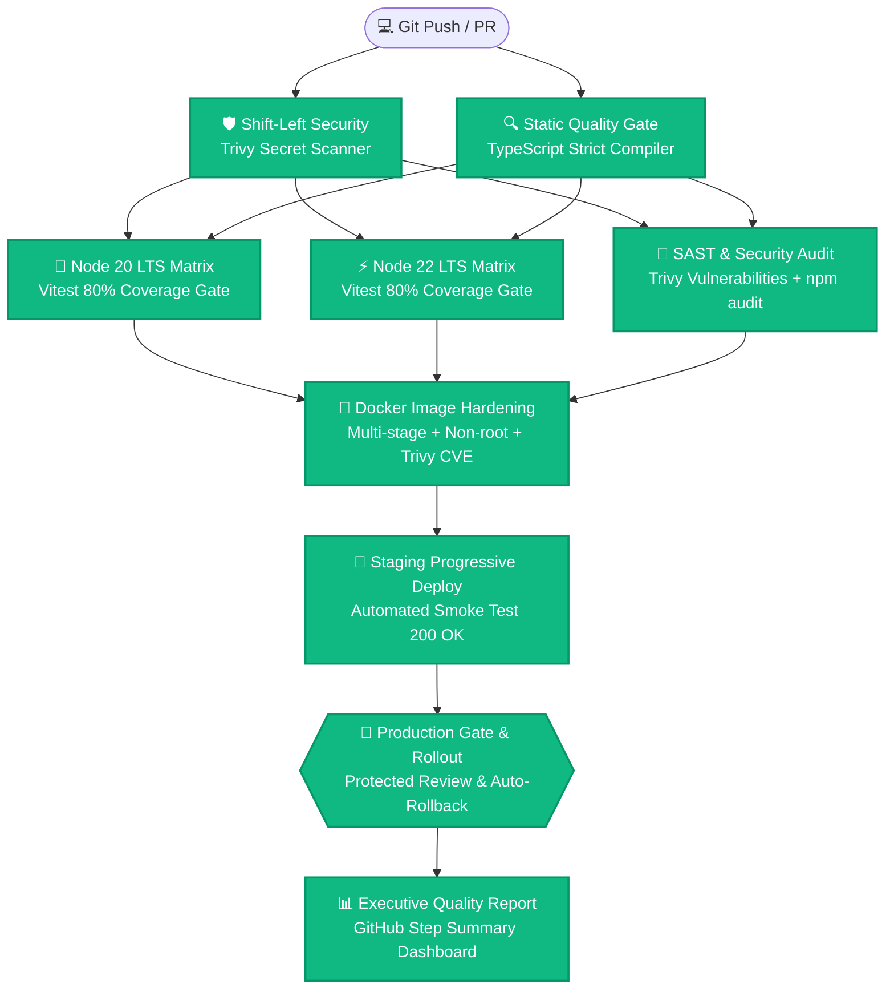

# 🛡️ Enterprise-Grade CI/CD Platform

<div align="center">

  <!-- Live Status Badges with Official Logos -->
  <a href="https://github.com/Ma1910/test-cicd/actions">
    
  </a>
  <a href="https://github.com/Ma1910/test-cicd">
    
  </a>
  <a href="https://github.com/Ma1910/test-cicd">
    
  </a>
  <a href="https://github.com/Ma1910/test-cicd">
    
  </a>

  <br/><br/>

  <!-- Official Technology Vector Badges -->
  
  
  
  
  
  

  <p align="center">
    <em>Quy trình tích hợp và triển khai liên tục (CI/CD) đồ họa phân luồng chuẩn Senior DevOps.</em>
  </p>

</div>

---

## 🏛️ Sơ đồ Luồng Đồ Thị Pipeline (DAG Flowchart)



---

## 🔒 Các tiêu chuẩn kiểm duyệt nghiêm ngặt

- **Shift-Left Security**: Tự động phát hiện và chặn đứng mọi token, private key rò rỉ.
- **Parallel Matrix Testing**: Chạy song song trên cả 2 phiên bản Node 20 LTS và Node 22 LTS.
- **Coverage Gate**: Ngưỡng bắt buộc $\ge 80\%$ test coverage (hiện tại đạt 100%).
- **Container Hardening**: Multi-stage, user `node` non-root, quét sạch CVE trước khi push.
- **Staging Progressive Delivery**: Tự động kiểm tra liveness và độ trễ phản hồi qua Smoke Test.
- **Production Gate & Auto-Rollback**: Bảo vệ an toàn tuyệt đối cho môi trường khách hàng sử dụng.

---

## 🛠️ Kiểm thử cục bộ

```bash
# 1. Chạy test và đo độ phủ Coverage nghiêm ngặt (Yêu cầu >= 80%)
npm run test:coverage

# 2. Kiểm tra kiểu dữ liệu nghiêm ngặt
npm run typecheck

# 3. Build mã nguồn production
npm run build
```
